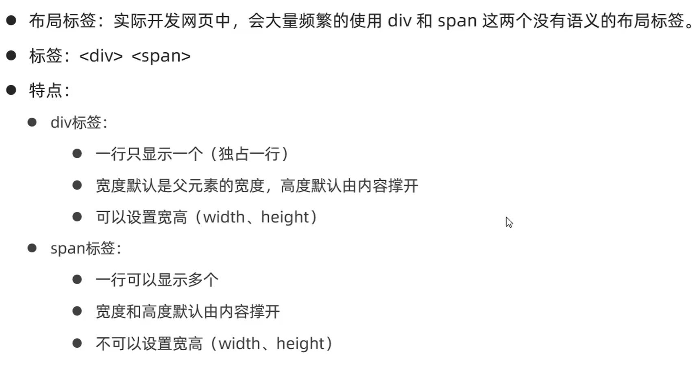
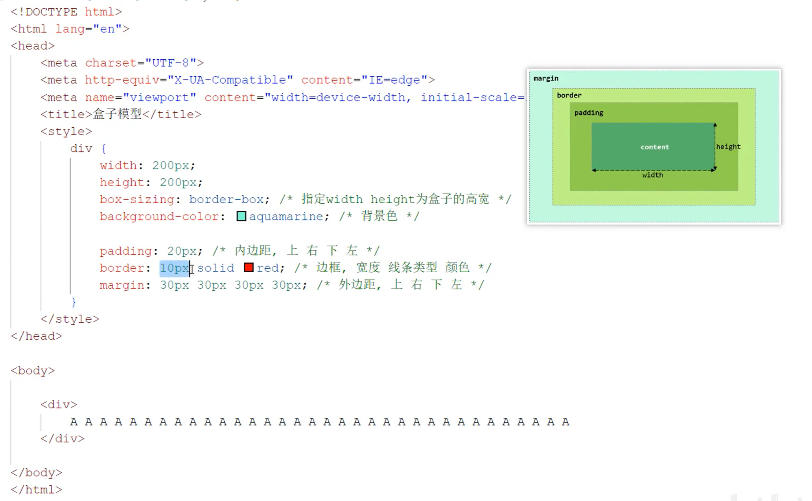
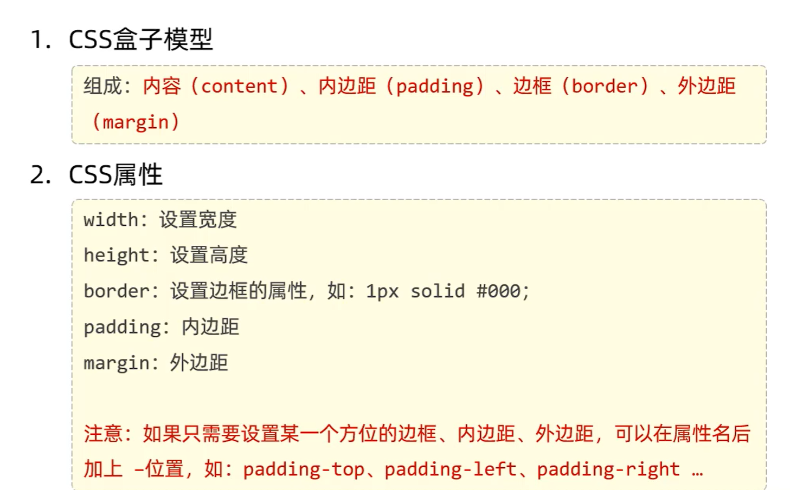
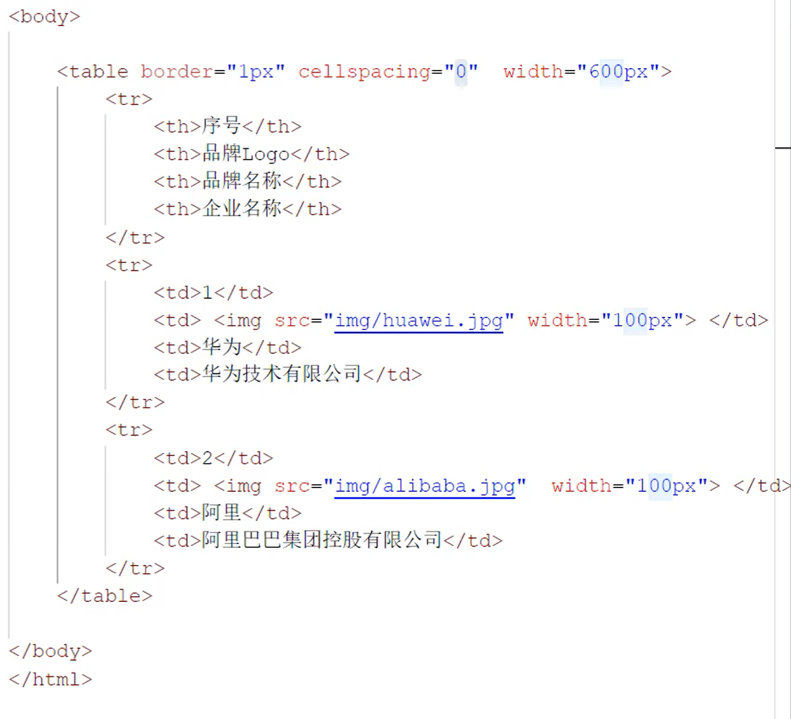

# HTML CSS (正文排版+整体布局)

1.视频标签\<video>:
    
    属性：
    src:视频播放路径
    control:播放控件
    width：控制宽度
    height：控制高度

2.音频标签\<audio>：
    
    属性：
    src:url


3.段落标签\<p>/换行\<br>(一个br换一行，没有br就不会换行)

也可以用\<p>\</p>包裹来分段

css首行缩进：

text-indent：定义首行缩进多少个像素

line-height：设置行高

4.文本加粗\<b>/\<strong>

注意：HTML中无论多少个空格都只会生成一个空格，添加空格使用\&nbsp;

## 整体布局调整：
[css盒子模型] 四个区域：

内容部分(content)、内边距部分(padding)、边框部分(border)、外边距部分(margin)







[CSS官网文档](https://www.w3school.com.cn/)

## 表格表单

```html
整张表
<table>属性：border,cellspacing,width

每一行
<tr>

每一个单元格
<td>

表头单元格
<th>
```

