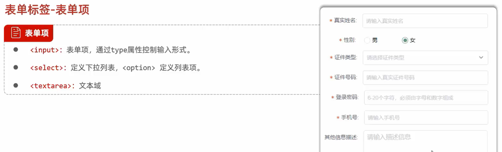
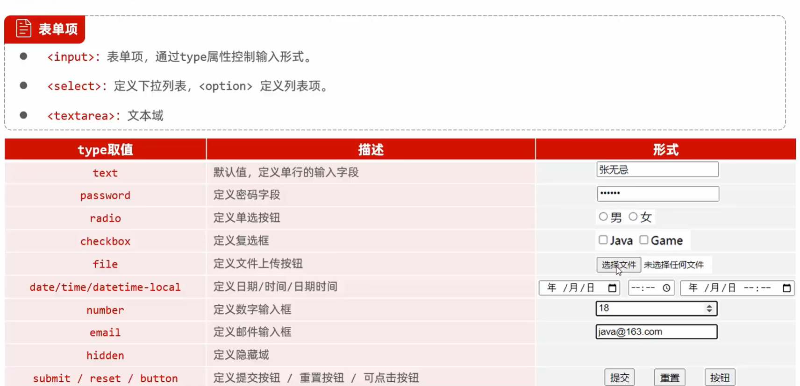

## 表单
```html
标签<form>
表单项：
<input>定义表单项，通过type属性控制输入
<select>定义下拉列表
<textarea>定义文本域
属性：
    action：往何处发送数据(default:提交到当前界面)
    method：提交方式 get(当前界面提交表单)/post(消息体或者请求体中传递)
```
```html
<form action="" method="get">
    用户名：<input type="text" name="username">
    年龄：<input type = "text" name = "age">
    <input type = "submit" value="提交">
<\form>
```

## 表单项标签



