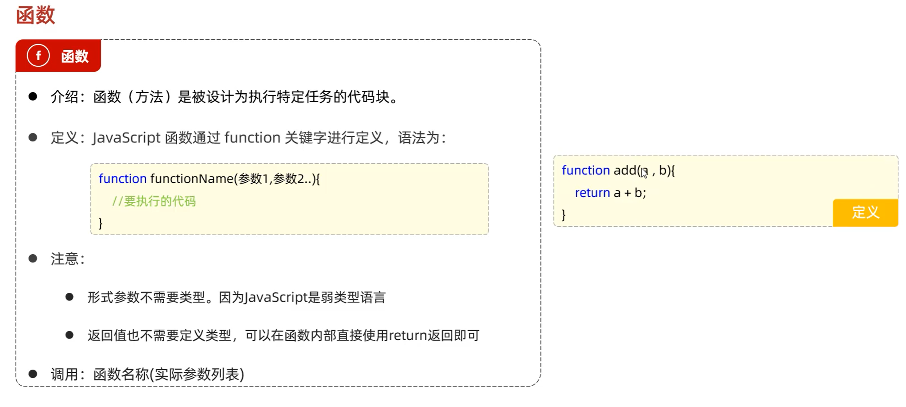
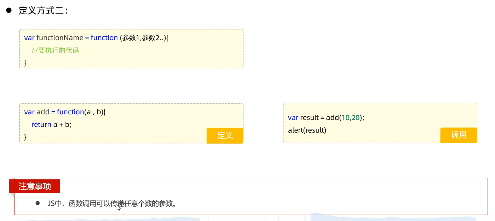
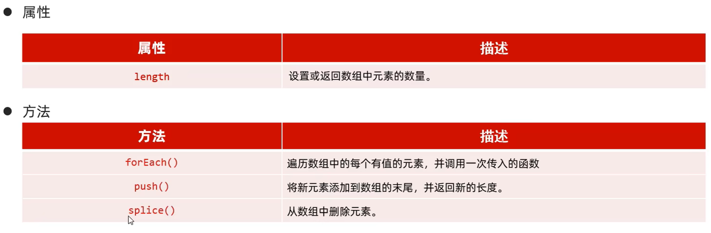
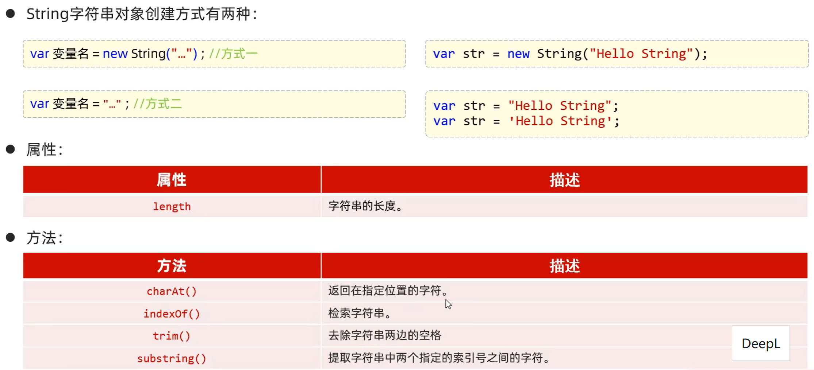
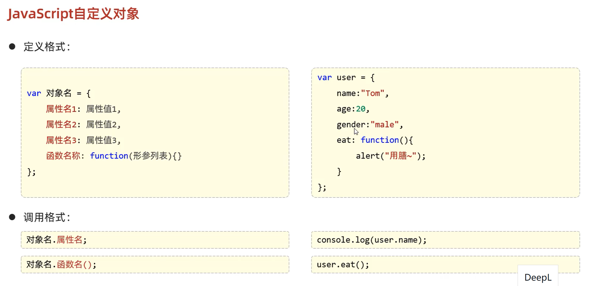
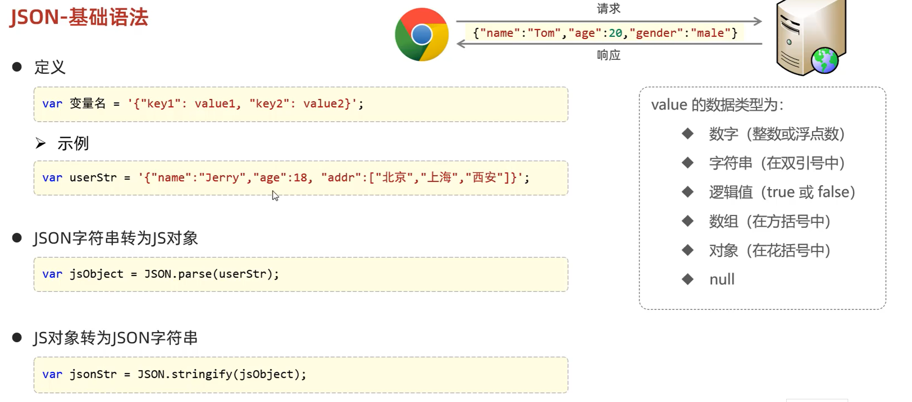
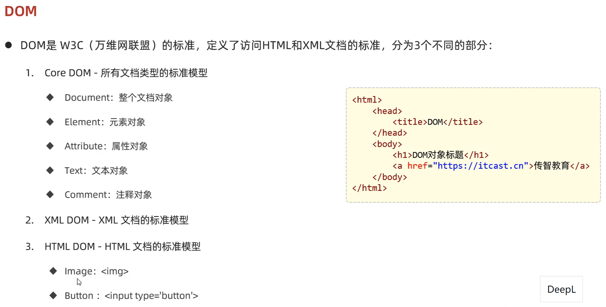

# JS

## JavaScript引入方式
- 内部脚本

- 外部脚本
  
  不能自闭合，注意
  

输出方式：

window.alert():写入警告框

document.write():写入HTML界面

console.log():写入浏览器控制台

比较运算符：

==：等于运算符（对比会进行类型转换）

===：全等运算符（对比时不会进行类型转换）

## 定义函数

## JS对象

**Array:**

ES6 箭头函数(...)=>{...}
用来简化函数定义

**String:**

**JSON:**

自定义对象：

**BOM:**

**DOM:**

